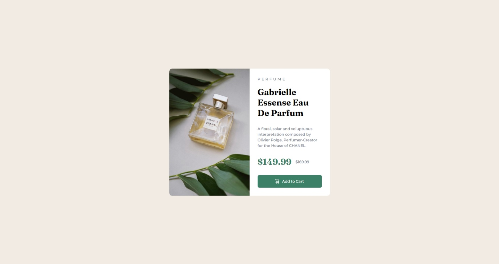

# Frontend Mentor - Product preview card component solution

This is a solution to the [Product preview card component challenge on Frontend Mentor](https://www.frontendmentor.io/challenges/product-preview-card-component-GO7UmttRfa). Frontend Mentor challenges help you improve your coding skills by building realistic projects. 

 ## Table of contents

- [Overview](#overview)
  - [Screenshot](#screenshot)
  - [Links](#links)
- [My process](#my-process)
  - [Built with](#built-with)
  - [What I learned](#what-i-learned)
  - [Continued development](#continued-development)
  - [Useful resources](#useful-resources)
- [Author](#author)
- [Acknowledgments](#acknowledgments)

## Overview

### Screenshot

Desktop Screenshot

Mobile Screenshot  

### Links

- Solution URL: [Github](https://github.com/adewalemudasiru/Product-Preview-Card)
- Live Site URL: [SolutionPreview](https://adewalemudasiru.github.io/Blog-Preview-Card/)

## My process

I created a container and nested two divs inside of it. The first div was used to hold the product image and the second div the product information. I set a fixed width for the container and let the image and product div take 50% width each. I then gave the container a display flex to control the directions of the two divs. In the image div, I added the mobile and desktop image to the container and set the mobile image to display none for desktop and vise versa for mobile. I added padding, borders, font-style and sizes, and color to replicate the design.

### Built with

- Semantic HTML5 markup
- CSS custom properties
- Flexbox
- Mobile-first workflow

### What I learned

I learned how important specifity is in css when styling elements. I encountered some issues adding styles to the span element and was forced to use the !important property. I however, reviewed the css and made changes to apply the styles to the span element without the need of the !important property.

### Continued development

I'm currently learning react and although I'm lagging in javascript. I'm hoping to improve on it while diving deep into react.

## Author

- Website - [Adewale Mudasiru](https://github.com/adewalemudasiru)
- Frontend Mentor - [@adewalemudasiru](https://www.frontendmentor.io/profile/adewalemudasiru)
- Twitter - [@ade_mudasiru](https://www.twitter.com/ade_mudasiru)

## Acknowledgments

ChatGPT for helping me understand css specifity.