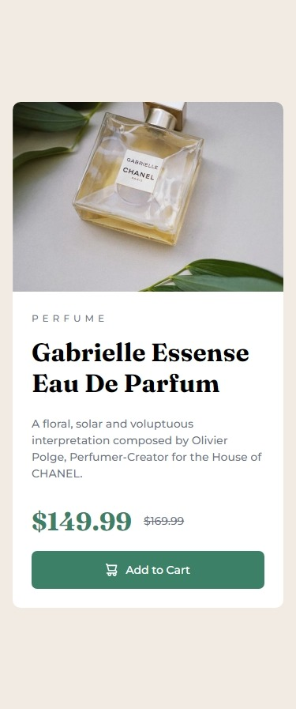

# Frontend Mentor - Product preview card component solution

This is a solution to the [Product preview card component challenge on Frontend Mentor](https://www.frontendmentor.io/challenges/product-preview-card-component-GO7UmttRfa). Frontend Mentor challenges help you improve your coding skills by building realistic projects. 

 ## Table of contents

- [Overview](#overview)
  - [Screenshot](#screenshot)
  - [Links](#links)
- [My process](#my-process)
  - [Built with](#built-with)
  - [What I learned](#what-i-learned)
  - [Continued development](#continued-development)
  - [Useful resources](#useful-resources)
- [Author](#author)
- [Acknowledgments](#acknowledgments)

## Overview

### Screenshot

Desktop Screenshot

Mobile Screenshot  

### Links

- Solution URL: [Github](https://github.com/adewalemudasiru/Blog-Preview-Card)
- Live Site URL: [SolutionPreview](https://adewalemudasiru.github.io/Blog-Preview-Card/)

## My process

I created a div container and nested three divs inside it. The first div was used to hold the image, the second for the blog content (category text, pulish date, article title and description) and the third for the author profile/link. This allowed me to easily control and space the blog card content. I gave the container div a padding of 1.5rem and applide a display grid on the content div and gave it a gap of 1.568rem. I then used a display flex for the author div and gave it a gap of 0.75rem.

### Built with

- Semantic HTML5 markup
- CSS custom properties
- Flexbox
- CSS Grid
- Mobile-first workflow

### What I learned

I learned how to properly style the the span tag.

### Continued development

Javascript is proving to be my greatest nightmare and I'm going to keep learning it. I want to also improve on my css skills and learn how to use the calc function and more ways to use flexbox and grid.

## Author

- Website - [Adewale Mudasiru](https://www.your-site.com)
- Frontend Mentor - [@adewalemudasiru](https://www.frontendmentor.io/profile/adewalemudasiru)
- Twitter - [@ade_mudasiru](https://www.twitter.com/ade_mudasiru)

## Acknowledgments

ChatGPT helped me figure out how to add shadows to an element.
